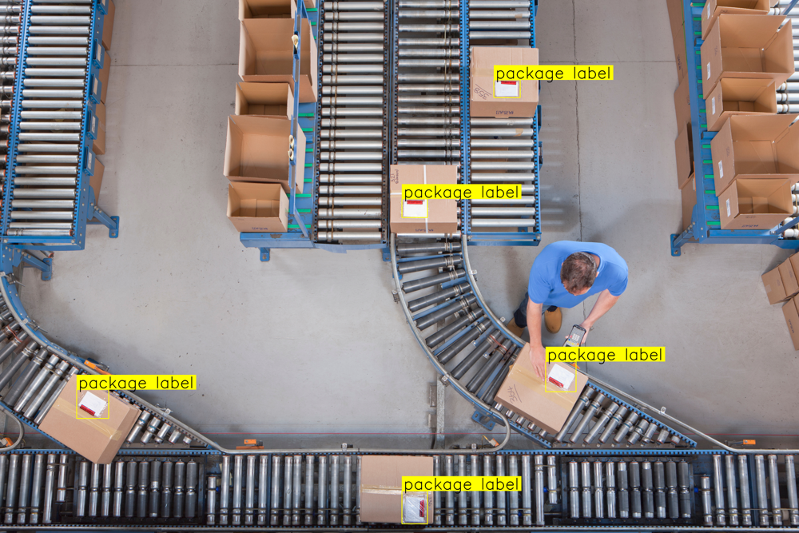
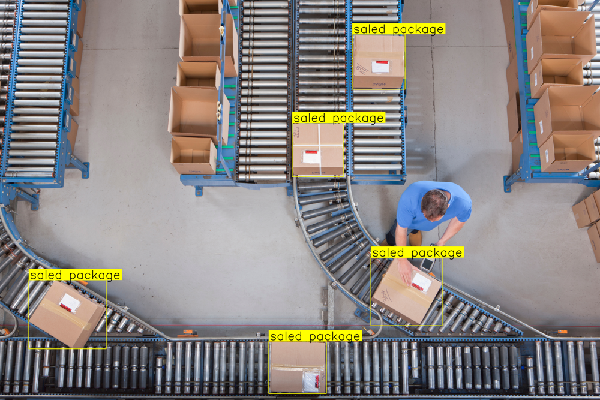
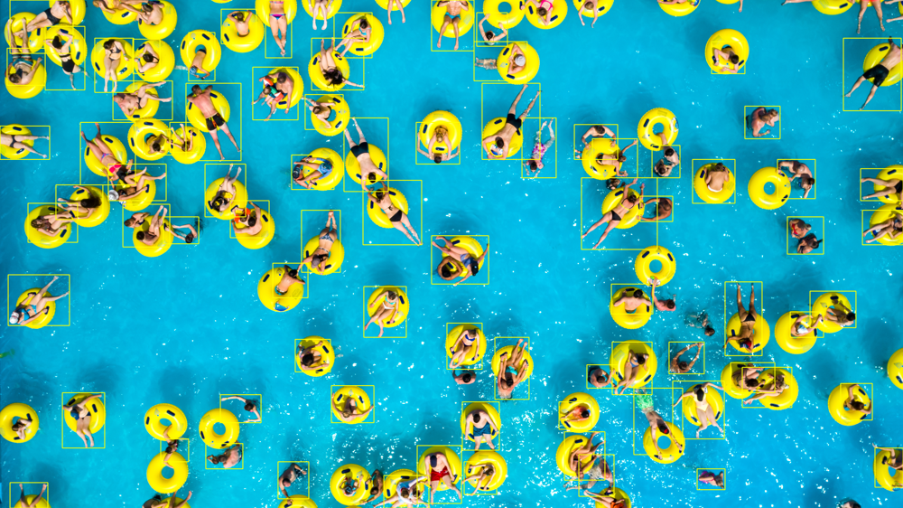

<div align="center">

# Gemini Vision Pipeline


### Zero-shot object detection powered by Google Gemini 3.5 Flash

Point at any image. Name what you want to find.
Get back tight bounding boxes — **no training, no labelling, no dataset.**


</div>

---

## See it in action

Every box below was drawn by a single `detect_and_annotate()` call. The classes
were passed as plain strings — nothing was trained.

<table>
<tr>
<td width="33%"></td>
<td width="33%"></td>
<td width="33%"></td>
</tr>
<tr>
<td align="center"><code>"package label"</code></td>
<td align="center"><code>"sealed package"</code></td>
<td align="center"><code>"person"</code> · dense scene</td>
</tr>
</table>

---

## Why you'll like it

- **Zero-shot — really.** No training run, no annotated dataset, no fine-tuning.
  Describe a class in plain language — `"avocado without the pit"`,
  `"car on the 3rd lane"` — and Gemini finds it.
- **One call replaces a notebook.** The original Colab repeated the same
  detection block ten times. Here it is a single `ObjectDetector` call.
- **Built for crowded images.** Structured-output mode forces schema-valid JSON,
  so dense scenes don't truncate mid-array.
- **Use it your way.** A `gemini-vision` CLI for the terminal, a clean, typed
  Python API for your code.
- **Packaged properly.** Type hints throughout, Google-style docstrings, linted
  with `ruff`, and covered by 15 tests that never touch the network.

## Features

- Detect any number of classes in a single API call
- Tight bounding boxes, parsed via [supervision](https://github.com/roboflow/supervision)
- Annotated image output with an automatic colour palette
- JSON export of raw detections
- Configurable model, temperature, and thinking budget

## Quickstart

Requires Python 3.11+ and [uv](https://docs.astral.sh/uv/).

```bash
# 1 — install
uv sync

# 2 — add your Gemini API key (free at https://aistudio.google.com/apikey)
cp .env.example .env        # then edit .env

# 3 — detect
uv run gemini-vision detect photo.jpg --classes "car,truck,bus" -o annotated.jpg
```

No model download, no dataset — your first detection in under a minute.

> After `uv sync`, either activate the environment (`source .venv/bin/activate`)
> or prefix the commands below with `uv run`.

<details>
<summary><b>Installing with pip instead</b></summary>

<br>

`pip` does not read `[tool.uv.sources]`, so the `supervision` branch must be
installed explicitly:

```bash
pip install -e .
pip install "supervision @ git+https://github.com/roboflow/supervision.git@add-gemini-3.5-vlm-support"
```

</details>

## CLI

```bash
# Detect and save an annotated image
gemini-vision detect image.jpg --classes "car,truck,bus" --output annotated.jpg

# Force structured JSON output for dense scenes
gemini-vision detect image.jpg --classes "person" --structured

# Export detections as JSON, with no labels drawn on the boxes
gemini-vision detect image.jpg --classes "car" --no-labels --json-out detections.json
```

| Option | What it does |
|---|---|
| `--classes` | Comma-separated class names *(required)* |
| `--output` / `-o` | Save the annotated image here |
| `--json-out` | Save detections as JSON here |
| `--structured` | Force schema-constrained JSON output |
| `--no-labels` | Draw boxes without class labels |
| `--model` | Override the Gemini model |

## Python API

```python
from gemini_vision import ObjectDetector

detector = ObjectDetector()
result, annotated = detector.detect_and_annotate(
    "image.jpg",
    classes=["car", "truck", "bus"],
)

print(f"Detected {len(result.detections)} objects")
annotated.save("annotated.jpg")
```

`result` is a typed `DetectionResult`; `annotated` is a ready-to-save `PIL` image.

## How it works

```
image + class names ─▶ prompt ─▶ Gemini 3.5 Flash ─▶ JSON ─▶ DetectionResult ─▶ annotated image
```

Each stage is its own small module — `prompts`, `client`, `detector`, `schemas`,
`annotator` — so every piece can be read, reused, and tested on its own.

## Examples

Three runnable scripts live in [`examples/`](examples/):

| Script | Demonstrates |
|---|---|
| `01_single_class.py` | Single-class detection (air balloons) |
| `02_multi_class.py` | Multi-class detection (avocados) |
| `03_structured_output.py` | Structured output on a dense scene (people) |

Download the example images first, then run any of the three:

```bash
bash scripts/download_examples.sh
uv run python examples/01_single_class.py
```

## Project structure

```
src/gemini_vision/   the package — config, client, prompts, schemas,
                     detector, annotator, CLI
examples/            standalone usage scripts
notebooks/           the original Colab notebook, kept for reference
scripts/             image download helper
tests/               unit tests (Gemini API mocked)
```

## Notes

- `supervision` is installed from the Git branch `add-gemini-3.5-vlm-support`.
  Swap it for the PyPI release once Gemini 3.5 support is merged upstream.

## License

[Apache-2.0](LICENSE).
